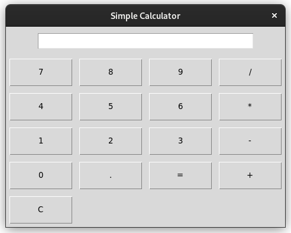

# basiccalculator
# GUI Calculator using Tkinter

This is a basic GUI calculator application created using Python and the Tkinter library. The calculator allows users to perform simple arithmetic calculations using a graphical user interface.



## Features

- Addition (+)
- Subtraction (-)
- Multiplication (*)
- Division (/)
- Clear (C)
- Equals (=)

## Requirements

- Python 3
- Tkinter (which comes pre-installed with Python)

## How to Run

1. Clone this repository or download the `gui_calculator.py` file to your local machine.

2. Open a terminal or command prompt and navigate to the directory where `gui_calculator.py` is located.

3. Run the script using the Python interpreter:

   ```bash
   python gui_calculator.py
